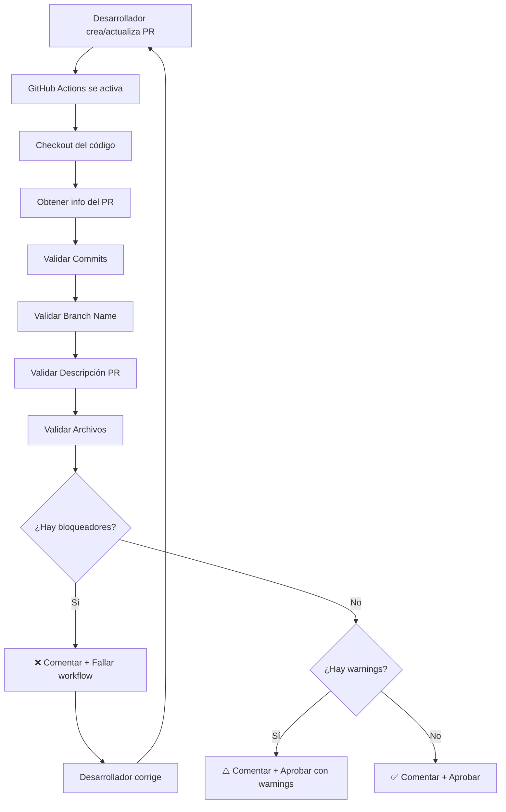

# 🤖 PR Reviewer - Automatización con GitHub Actions

Sistema de validación automática de Pull Requests basado en las reglas de desarrollo de bancadigital-bm-app.

## 📋 Descripción

Este workflow se ejecuta **automáticamente** cada vez que:
- Se abre un nuevo PR
- Se actualiza un PR existente (nuevos commits)
- Se edita la descripción del PR

## 🎯 Validaciones Automáticas

### 1. ✅ Commits
- Formato: `[tipo][BC-XXXXX] Módulo: Descripción` (donde `BC` es el prefijo fijo de los tickets para este proyecto)
- Tipo válido (ft, fx, tt, rf, cr, wr, hf, poc, devops)
- Ticket ID presente y válido
- Módulo especificado
- Descripción clara sin diminutivos

### 2. 🌿 Branch Name
- Formato: `tipo/numeroTicket_descripcion` (donde `numeroTicket` es el número de ticket, por ejemplo: `ft/35367_agregar_boton_favoritos`)
- Tipos válidos: ft, fx, tt, rf, cr, wr, hf, poc, devops
- Snake_case en descripción
- Número de ticket coincide con commits

### 3. 📄 Descripción del PR
- Plantilla completa con todas las secciones
- Link válido de Azure Boards en formato markdown
- Descripción detallada de cambios
- Sección de evidencias visuales

### 4. 📂 Archivos Modificados
- Tests agregados para código nuevo
- Archivos sensibles no modificados accidentalmente
- Estructura de directorios correcta

### 5. 🏗️ Clean Architecture Base
- Domain no depende de Flutter ni de capas externas
- Data no depende de UI
- Entities de Domain sin serialización
- DTOs sin `@freezed` generan advertencia

### 6. 🧪 Patrones Críticos de Flutter
- `super.initState()` como primera instrucción
- `super.dispose()` al final del método
- Uso de GoRouter en lugar de `Navigator` directo
- Validación de `mounted` antes de navegación asíncrona

## 🚦 Resultados

El workflow genera un comentario en el PR con tres niveles:

### 🚫 Bloqueadores (CRÍTICOS)
```
❌ COMMIT INVÁLIDO: [ft] Fix bug en login
   → Tipo incorrecto: fix es [fx], no [ft]
```
**Acción:** Debe corregirse antes de mergear. El workflow fallará.

### ⚠️ Advertencias
```
⚠️ FALTA AGREGAR TESTS
   → Se modificaron 5 archivos .dart pero no hay _test.dart
   → Se recomienda agregar tests (cobertura mínima: 80%)
```
**Acción:** Se recomienda corregir, pero no bloquea el merge.

### ✅ Aprobaciones
```
✅ Commit válido: [ft][BC-35367] Cards: Agregar botón de favoritos
✅ Branch name válido: ft/35367_agregar_boton_favoritos
✅ PR incluye tests (3 archivos _test.dart)
```
**Acción:** Todo correcto, continúa.

## 📁 Archivos del Sistema

```
.github/
├── workflows/
│   └── pr-reviewer-automation.yml    # Workflow principal
├── agents/
│   └── pr-reviewer.agent.md          # Agente para uso manual
├── scripts/
│   └── pr_reviewer_validator.py      # Script de validación
├── skills/
│   ├── commit-conventions/SKILL.md
│   ├── branch-naming/SKILL.md
│   ├── pr-description/SKILL.md
│   ├── testing-unified/SKILL.md
│   └── module-creation/SKILL.md
```

## 🔧 Configuración

### Permisos Requeridos

El workflow necesita estos permisos en GitHub:
```yaml
permissions:
  contents: read           # Leer código del repositorio
  pull-requests: write     # Comentar en PRs
  issues: write            # Gestionar issues (crear/actualizar/comentar issues, si aplica)
```

### Variables de Entorno

No requiere secrets adicionales. Usa `GITHUB_TOKEN` automático.

### Instalación

1. **Merge este PR** que incluye:
   - `.github/workflows/pr-reviewer-automation.yml`
   - `.github/scripts/pr_reviewer_validator.py`
   - Todos los skills y agentes

2. **El workflow se activa automáticamente** en el siguiente PR

3. **No requiere configuración adicional**

## 🔄 Flujo de Trabajo



## 📝 Ejemplo de Comentario

```markdown
# 🤖 PR Reviewer - Validación Automática - Leo

**Estado:** ⚠️ **CON ADVERTENCIAS**
**PR:** #5052
**Branch:** `ft/35367_agregar_boton_favoritos`
**Fecha:** 2026-02-24T10:30:00Z

---

## ⚠️ Advertencias (2)

⚠️ **FALTA AGREGAR TESTS**
   - Se modificaron 5 archivos .dart
   - No se encontraron tests (_test.dart)
   - Se recomienda agregar tests unitarios (cobertura mínima: 80%)

⚠️ **DIMINUTIVO DETECTADO:** `btn` en `[ft][BC-35367] Cards: Agregar btn de favoritos`
   - Evita diminutivos, usa palabras completas

---

## ✅ Validaciones Aprobadas (8)

✅ Commit válido: `[ft][BC-35367] Cards: Agregar botón de favoritos`
✅ Branch name válido: `ft/35367_agregar_boton_favoritos`
✅ PR tiene todas las secciones requeridas
✅ PR tiene referencia a Azure Boards (AB#)
✅ Checklist completo (5/5 ítems)

---

*🤖 Generado automáticamente por PR Reviewer v1.0*
```

## 💡 Reviews Manuales Complementarios

Para análisis más profundo (arquitectura, code quality, performance):

```bash
# En Copilot Chat de VS Code
Leo, revisa este PR en profundidad
```

El agente manual (`agents/pr-reviewer.agent.md`) complementa esta validación con:
- Análisis de arquitectura Clean + MVVM
- Code quality y anti-patterns
- Performance y optimizaciones
- Security concerns
- Documentación técnica (ADRs)

## 🆚 Automático vs Manual

| Aspecto | Automático (GitHub Actions) | Manual (Copilot Agent) |
|---------|----------------------------|------------------------|
| **Commits** | ✅ Formato y estructura | ✅ Cohesión y atomicidad |
| **Branch** | ✅ Nomenclatura | ✅ Estrategia de versionado |
| **PR Description** | ✅ Plantilla, Azure Boards y evidencias | ✅ Claridad y contexto |
| **Arquitectura** | ⚠️ Dependencias y capas base | ✅ Clean Arch + MVVM |
| **Testing** | ✅ Presencia de tests | ✅ Calidad y coverage |
| **Code Quality** | ⚠️ Lifecycle y navegación crítica | ✅ Anti-patterns, leaks |
| **Performance** | ❌ No valida | ✅ Optimizaciones |
| **Documentación** | ⚠️ Template y links críticos | ✅ ADRs, READMEs |
| **Timing** | ⚡ Inmediato (1-2 min) | 🧠 Bajo demanda |

**Recomendación:** Usa ambos
1. Automático corrige errores básicos rápido
2. Manual antes de solicitar review final

## 🛠️ Mantenimiento

### Actualizar Reglas de Validación

Edita el script Python:
```bash
.github/scripts/pr_reviewer_validator.py
```

### Agregar Nuevas Validaciones

1. Agrega método `validate_X()` en el script
2. Llámalo desde `run()`
3. Actualiza esta documentación

### Desactivar Temporalmente

Edita el workflow:
```yaml
# Comentar o cambiar las branches
on:
  pull_request:
    branches:
      # - main
      # - develop
```

## 📊 Métricas

Para conocer efectividad del sistema:

```bash
# Ver PRs con bloqueadores detectados
gh pr list --search "comments:>5" --state closed

# Ver tasa de aprobación en primer intento
# (manualmente verificar comentarios del bot)
```

## 🐛 Troubleshooting

### El workflow no se ejecuta
- Verifica que el PR apunte a `main`, `develop` o `release-**`
- Revisa permisos en Settings → Actions

### El comentario no aparece
- Verifica permisos `pull-requests: write`
- Revisa logs del workflow en Actions tab

### Falsos positivos
- Edita reglas en `pr_reviewer_validator.py`
- Ajusta expresiones regulares según necesidad

## 📚 Referencias

- [Guía de Commits](../skills/commit-conventions/SKILL.md)
- [Branch Strategy](../../docs/collaboration/branching_strategy_and_versioning.md)
- [Testing Guidelines](../../docs/development/unit_testing.md)
- [Architecture Guide](../../docs/architecture/architecture.md)

---

**Versión:** 1.0.0  
**Autor:** Copilot Engineering System  
**Última actualización:** 2026-02-24
